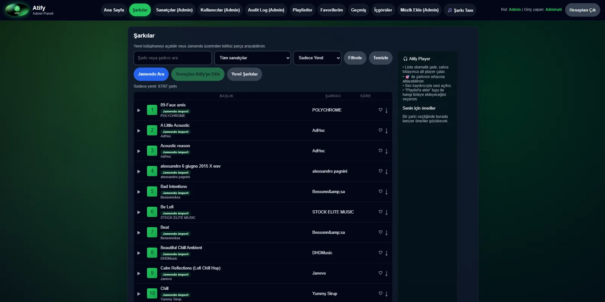
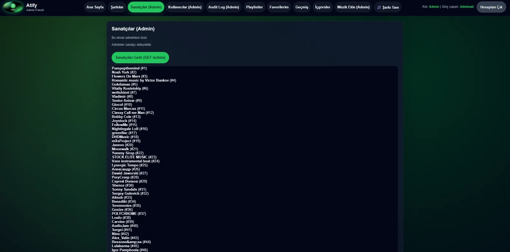

# Atify Backend

Atify, Spring Boot tabanli muzik uygulamasi backend'idir. Static frontend dosyalari da ayni uygulama icinden servis edilir.

Canli uygulama: [atify.com.tr](https://atify.com.tr)  
Mobil istemci: [ShaNuva66/Atify-Mobile](https://github.com/ShaNuva66/Atify-Mobile)



## Neler var?

- JWT access/refresh token tabanli kimlik dogrulama
- Rol tabanli kullanici ve yonetim akislari
- Sarki, sanatci, favori ve oynatma listesi yonetimi
- Muzik tanima ve dosya parmak izi akisi
- MySQL, Redis, Actuator, Prometheus ve OpenAPI destegi
- Docker Compose ve VPS yayin scriptleri
- `/Yenicag/` altinda 1v1 ve dort oyunculu sira tabanli online arena oyunu



## Lokal gelistirme

```bash
./mvnw spring-boot:run
```

Windows:

```powershell
.\mvnw.cmd spring-boot:run
```

## Test

```bash
./mvnw test
```

UI smoke testi:

```powershell
python .\ops\ui_smoke.py `
  --base-url https://atify.com.tr `
  --mode both `
  --ssh-host 89.47.113.106 `
  --ssh-user atify `
  --ssh-key "$env:USERPROFILE\.ssh\atify_prod_ed25519"
```

Notlar:

- Script temp user ve temp admin hesabi olusturur.
- Admin hesabini SSH uzerinden `user_roles` tablosuna ekler.
- Is bitince temp hesaplari temizler.
- `selenium` ve `requests` kurulu bir Python ortami bekler.
- Screenshot almak istersen `--artifacts-dir .\tmp\ui-smoke` ekleyebilirsin.

Fingerprint smoke testi:

```powershell
python .\ops\fingerprint_smoke.py
```

Canli production fingerprint smoke testi:

```powershell
python .\ops\fingerprint_live_smoke.py `
  --base-url https://atify.com.tr `
  --ssh-host 89.47.113.106 `
  --ssh-user atify `
  --ssh-key "$env:USERPROFILE\.ssh\atify_prod_ed25519"
```

## Yenicag Arena

Oyun servisi `Yenicag/` klasorundedir. Lokal olarak calistirmak icin:

```powershell
cd .\Yenicag
npm ci
npm test
npm start
```

Production ortaminda Caddy, `/Yenicag/` isteklerini ve WebSocket baglantilarini
ayri Node.js oyun servisine yonlendirir. Yayin adresi:
`https://atify.com.tr/Yenicag/`

## Production

Production deploy ve operasyon notlari:

- [docs/deploy-domain.md](docs/deploy-domain.md)

Ana script'ler:

- `deploy/server-bootstrap.sh`
- `deploy/start-prod.sh`
- `deploy/update-prod.sh`
- `deploy/backup-prod.sh`
- `deploy/harden-server.sh`
- `ops/sync-prod.ps1`
- `ops/setup-prod-access.ps1`


